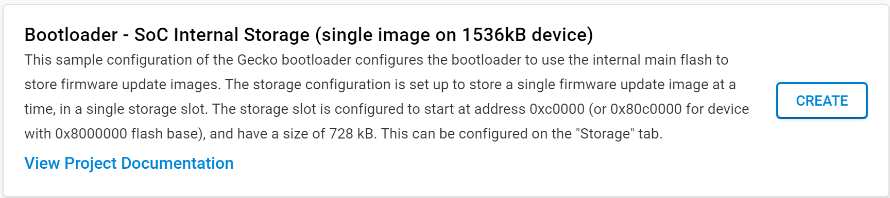
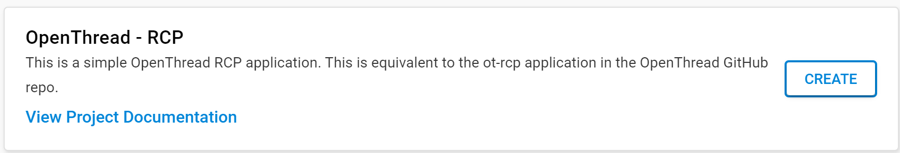
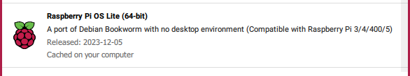
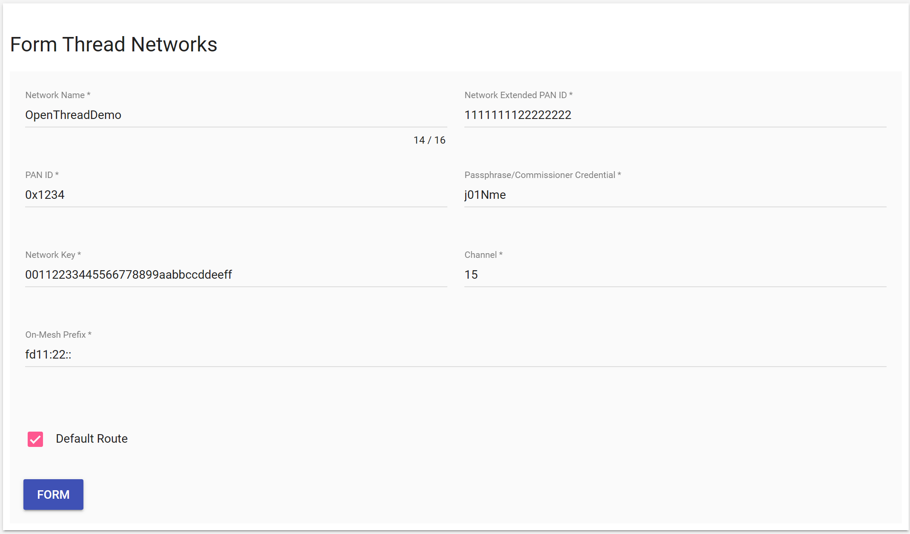

# Building a OpenThread Border Router using a Raspberry Pi and a Silicon Labs Matter / Thread Development Board
### Author: [Olav Tollefsen](https://www.linkedin.com/in/olavtollefsen/)

## Introduction

This article shows how to build an OpenThread Border Router using a Raspberry Pi and a Silicon Labs Matter / Thread Development Board

This article is based on Silicon Labs Gecko SDK version 4.3.2

### What you will need

- A PC running Windows as the development workstation.
- Install Simplicity Studio V5 from Silicon Labs.
- Raspberry Pi Model 3B or newer
- Silicon Labs xG24-DK2601B EFR32xG24 Dev Kit (or similar supported board).

## Concepts and overall scenario

The OpenThread Border Router concepts and overall scenario are described here:

https://openthread.io/guides/border-router

## Prepare the Raspberry Pi

Use Ubuntu as the operating system for Raspberry Pi.

We will be using OpenThread Border Router running in a Docker container.

To prepare the Raspberry Pi follow the instructions found here:

https://openthread.io/guides/border-router/docker

## Prepare the Silicon Labs Dev Kit to run the Radio Co-Processor (RCP) application

Connect your Silicon Labs Dev Kit to your PC using an USB cable and run Simplicity Studio.

### Prepare the Bootloader

Find the "Bootloader - SoC Internal Storage (single image on 1536kB device)" example project and create a new project from it. This bootloader is for the Silicon Labs xG24-DK2601B EFR32xG24 Dev Kit, which has 1536kB Flash.



Build the bootloader project, find the .s37 image file and flash it to your Silicon Labs Dev Kit.

### Prepare the OpenThread RCP application

Find the "OpenThread - RCP" example project and create a new project from it. 



Build the project, find the .s37 image file and flash it to your Silicon Labs Dev Kit.

## Install the OpenThread Border Router software on a Raspberry Pi

### Prepare the Raspberry Pi

Flash an approperiate version of the Raspberry Pi OS.



### Update the OS

```
$ sudo apt-get update
$ sudo apt-get upgrade
```

### Install Git

```
$ sudo apt install git
```

### Clone the OTBR repository:

```
$ git clone https://github.com/openthread/ot-br-posix
```

### Install dependencies

```
$ cd ot-br-posix
$ ./script/bootstrap
```

### Compile and install OTBR

```
INFRA_IF_NAME=eth0 ./script/setup
```

### Reboot the Raspberry Pi

The OTBR service should start on boot.

Verify that all required services are enabled:

```
$ sudo systemctl status
```

## Install Docker

```
$ sudo snap install docker
```

## Create the docker group and add your user:

```
$ sudo groupadd docker
$ sudo usermod -aG docker $USER
```

You may need to reboot for the group membership to take effect.

## Run OpenThread Border Router on the Raspberry Pi

Connect the Silicon Labs Dev Kit to an USB-port on the Raspberry Pi. A new port should appear under /dev. Typically named ttyACM0.

Remember to load the kernel modules for iptables:

```
$ sudo modprobe ip6table_filter
```

Make it permanent

```
sudo nano /etc/modules-load.d/modules.conf
```

Add a line with "ip6table_filter" and save.

Check if the "ip6table_filter" module is loaded:

```
lsmod | grep ip6table_filter
```

Run the following Docker command:

```
$ docker run --sysctl "net.ipv6.conf.all.disable_ipv6=0 net.ipv4.conf.all.forwarding=1 net.ipv6.conf.all.forwarding=1" -p 8080:80 --dns=127.0.0.1 -it --volume /dev/ttyACM0:/dev/ttyACM0 --privileged openthread/otbr --radio-url spinel+hdlc+uart:///dev/ttyACM0
```

The OpenThread Border Router should now be running.

## Form a Thread network

Open the IP-address of your Raspberry Pi on port 8080 to open the OpenThread Border Router Web Application.

Click on Form in the menu and then click on the "Form" button.



## Build Matter

The following steps are documented here: https://github.com/project-chip/connectedhomeip/blob/master/docs/guides/BUILDING.md

### Checking out the Matter code

```
$ git clone --recurse-submodules https://github.com/project-chip/connectedhomeip.git
```

### Updating Matter code

```
$ cd connectedhomeip/
$ git pull
$ git submodule update --init

```

### Installing prerequisites on Raspberry Pi 4

#### Installing prerequisites on Linux

```
$ sudo apt-get install git gcc g++ pkg-config libssl-dev libdbus-1-dev \
     libglib2.0-dev libavahi-client-dev ninja-build python3-venv python3-dev \
     python3-pip unzip libgirepository1.0-dev libcairo2-dev libreadline-dev
```

#### Install some Raspberry Pi specific dependencies:

```
$ sudo apt-get install pi-bluetooth avahi-utils
```

### Configuring wpa_supplicant for storing permanent changes

By default, wpa_supplicant is not allowed to update (overwrite) configuration. If you want the Matter application to be able to store the configuration changes permanently, you need to make the following changes:

1. Edit the dbus-fi.w1.wpa_supplicant1.service file to use configuration file instead by running the following command:

```
sudo nano /etc/systemd/system/dbus-fi.w1.wpa_supplicant1.service
```

2. Change the wpa_supplicant start parameters to::

```
ExecStart=/sbin/wpa_supplicant -u -s -i wlan0 -c /etc/wpa_supplicant/wpa_supplicant.conf
```

3. Add the wpa-supplicant configuration file by running the following command:

```
sudo nano /etc/wpa_supplicant/wpa_supplicant.conf
```

4. Add the following content to the wpa-supplicant file:

```
ctrl_interface=DIR=/run/wpa_supplicant
update_config=1
```

5. Reboot your Raspberry Pi.

### Prepare for building

Before running any other build command, the scripts/activate.sh environment setup script should be sourced at the top level. This script takes care of downloading GN, ninja, and setting up a Python environment with libraries used to build and test.

```
source scripts/activate.sh
```

If this script says the environment is out of date, it can be updated by running:

```
source scripts/bootstrap.sh
```

The scripts/bootstrap.sh script re-creates the environment from scratch, which is expensive, so avoid running it unless the environment is out of date.

### Building and running the CHIP Tool

```
mkdir out
$ ./scripts/examples/gn_build_example.sh examples/chip-tool out
```

## Test Matter Fabric with devices

...

#### Form a new Thread network

        sudo ot-ctl factoryreset
        sleep 3
        sudo ot-ctl srp server disable
        sudo ot-ctl thread stop
        sudo ot-ctl ifconfig down
        sudo ot-ctl dataset init new
        sudo ot-ctl dataset commit active
        sudo ot-ctl srp server enable
        sudo ot-ctl ifconfig up
        sudo ot-ctl thread start

### Obtaining Thread network credentials

When running directly on hardware:

```
sudo ot-ctl dataset active -x | sed -n 1p | sed -e "s/\r//g"
```

When running in Docker container

```
$ docker exec -it <container_id> sh -c "sudo ot-ctl dataset active -x"
```

### Commission a Matter over Thread Device using the chip-tool

```
./connectedhomeip/out/standalone/chip-tool pairing ble-thread 5535 hex:0e080000000000010000000300001435060004001fffe00208134a64c3f10ccb930708fd25da7f3d5c8ff2051019347339f0b597887b0f6b5f1bed98d3030f4f70656e5468726561642d353032310102502104105ebd52c120a93892c7ab2a42dc6fe8d40c0402a0f7f8 20202021 3840
```

### Commission a Matter over WiFi Device using the chip-tool

If you have a QR-code for the device it needs to be decoded to use it with the chip-tool.

Use a tool to decode the scanned QR-code into a code like this:

MT:6FCJ142C00KA0648G00

Use the chip-tool to decode the QR-code information:

```
$ chip-tool payload parse-setup-payload MT:6FCJ142C00KA0648G00
```

Commission the device:

```
$ chip-tool pairing ble-wifi <node_id> <SSID> <password> <setup_PIN_code> <discriminator> --bypass-attestation-verifier true
```

### Turn light On

```
./connectedhomeip/out/standalone/chip-tool onoff off 5535 1
```

### Read basic information from the Matter device

Every Matter device supports the Basic Information cluster, which maintains the collection of attributes that a controller can obtain from a device. These attributes can include the vendor name, the product name, or the software version.

Use the CHIP Tool's read command on the basicinformation cluster to read those values from the device:

```
$ ./chip-tool basicinformation read vendor-name <node_id> <endpoint_id>
$ ./chip-tool basicinformation read product-name <node_id> <endpoint_id>
$ ./chip-tool basicinformation read software-version <node_id> <endpoint_id>
```

You can also use the following command to list all available commands for the Basic Information cluster:

```
$ ./chip-tool basicinformation
```

### Forgetting the already-commissioned device

```
$ ./chip-tool pairing unpair <node_id>
```
